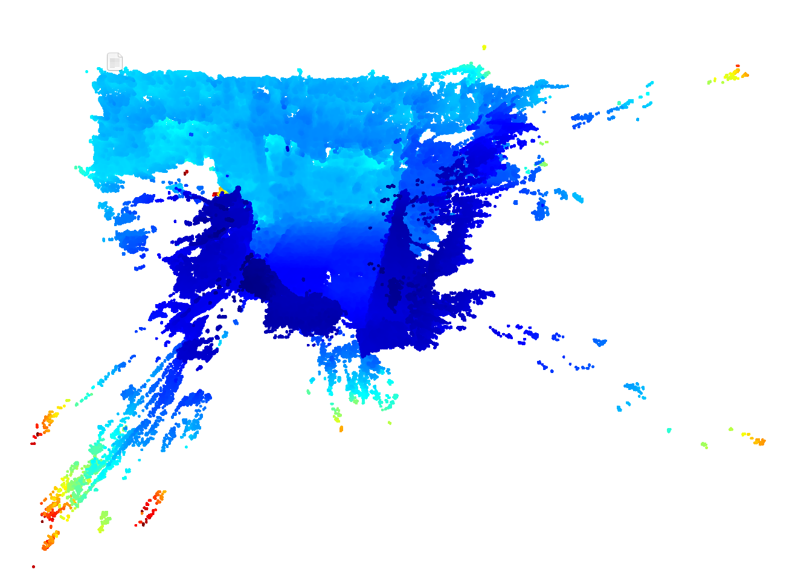
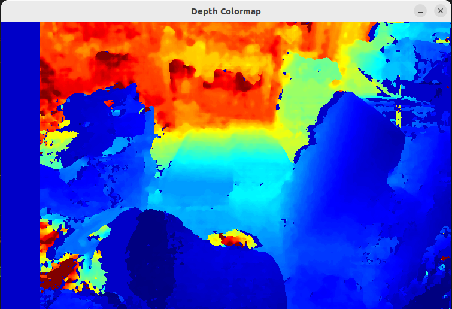

## 
实验一：相机标定
#### 实验设置
- 准备标定板、相机不同角度和距离拍下的标定板的数据
- 寻找每幅标定板的角点，细化像素坐标，绘制角点，计算角点在世界坐标系下的坐标
- 计算相机内参矩阵和畸变系数
- 对原始图像进行去畸变处理
#### 实验结果展示
   

   
相机内参矩阵

   
   

   

   
相机畸变系数

   
   

    
   

   
去畸变结果展示

   

  

    
    
<b>原始图像</b>

  

  

    
    
<b>去畸变后图像</b>

  

#### 分析
利用matlab进行相机标定，可以得到内参和畸变系数的精确值，其中第二幅图为径向畸变系数，第三幅图为切向畸变系数，如下图所示：
   

   
<b> </b> 

   
   

  

   
<b> </b> 

   
   

  

   
<b> </b> 

   
   

由此可分析出opencv内参矩阵和畸变系数标定的相对误差：

$$
\begin{aligned}
 \delta f_x &= \frac{f_x - f_x^{'}}{f_x} \times 100\%  = 0.72\% \qquad
   \delta f_y &= \frac{f_y - f_y^{'}}{f_y} \times 100\%  = 0.75\% \\
   \delta c_x &= \frac{c_x - c_x^{'}}{c_x} \times 100\%  = 0.35\% 
   \qquad \delta c_y &= \frac{c_y - c_y^{'}}{c_y} \times 100\%  = 1.05\% \\
   \delta k_1 &= \frac{k_1 - k_1^{'}}{k_1} \times 100\%  = 3.20\% \qquad
   \delta k_2 &= \frac{k_2 - k_2^{'}}{k_2} \times 100\%  = 2.78\% \\
   \delta k_3 &= \frac{p_1 - p_1^{'}}{p_1} \times 100\%  = 3.04\% \\
\end{aligned}
$$
可以看出，内参和径向畸变相对误差均较小，因此标定较为准确（不过切向畸变的误差较matlab标定值相差较大，可能是由于opencv标定算法存在误差导致的）

#### 思考题
假设目前的分辨率为 $ M \times N$，改变分辨率后图像的分辨率为 $M^{'} \times N^{'}$，相机的内参矩阵如下：
$$
K = \begin{bmatrix}
f_x & 0 & c_x \\
0 & f_y & c_y \\
0 & 0 & 1
\end{bmatrix}  
$$
其中 $c_x, c_y$ 为图像中心在图像坐标系下的坐标，单位为像素，而分辨率表示图像宽和高的像素个数，因此当分辨率改变后，图像中心的坐标 $c_x' = c_x \frac{M'}{M} \quad c_y' = c_y \frac{N'}{N}$。 而 $f_x$和$f_y$的公式如下：
$$
f_x = f \frac{M}{W} \quad f_y = f \frac{N}{H} 
$$
其中 $f$ 为焦距，$W$ 和 $H$ 为图像的宽和高，那么当分辨率 $M,N$改变后，$f_x' = f_x\frac{M'}{M}\quad f_y' = f_y \frac{N'}{N}$
而相机的畸变系数是由相机本身决定的，不会随图像分辨率的改变而改变

## 
实验二：双目立体视觉
#### 实验设置
- 进行双目相机的标定、畸变校正、立体校正
- 利用SGBM算法进行立体匹配并计算视差图
- 生成深度图、着色深度图并计算3d点云
#### 实验结果展示
   

   
<b>去畸变和校正后图像 </b> 

   
   

 
左侧上下分别为校正前和校正后的图像，右侧上下分别为校正前和校正后的图像，通过比较可以得到左右两侧的图像旋转一致，极线平行于x轴
   

   
<b>视差图 </b> 

   
   

 

  

    
    
<b>深度图像</b>

  

  

    
    
<b>着色深度图像</b>

  

 

   
<b>3D点云图</b>

   

#### 分析
sgbm算法中视差搜索范围对实验效果的影响：该参数增大会扩大视差范围，即视差图中可以估计的深度范围增大。如果增大的视差范围超过了场景中实际的深度范围，就会出现黑色区域。黑色区域表示无法进行有效的匹配或估计深度。 视差数量越多，能够获取到更多详细的深度信息。但是，增加视差数量也会增加计算量，可能会导致较慢的运行速度以及噪声增多 

  

    
    
<b>视差搜索范围为16</b>

  

  

    
    
<b>视差搜索范围为32</b>

  

  

    
    
<b>视差搜索范围为48</b>

  

  

    
    
<b>视差搜索范围为64</b>

  

  

    
    
<b>视差搜索范围为80</b>

  

  

    
    
<b>视差搜索范围为96</b>

  

#### 思考题
假设左相机的内参矩阵为 $K_L$，右相机的内参矩阵为 $K_R$,对右图像进行如下变换：
$$
\begin{aligned}
    P_W  &= Z K_R^{-1} I_R \\
    I_R' &= \frac{1}{Z} K_L P_W = K_LK_R^{-1}I_R
\end{aligned}
$$
得到的变换后的图像 $I_R'$ 具有与左相机相同的内参，在之后的双目匹配中即可利用$I_R'$与左图像进行匹配，这样的好处是简化了立体匹配和三维重建等任务，使立体匹配的精度提高，视差图和深度图的恢复效果更好，减少了由于内参差异带来的误差，提高了计算的精度，下面进行实验验证：

  

    
    
<b>校正前深度图像</b>

  

  

    
    
<b>校正后深度图像</b>

  

 通过对比可以发现，校正后的图像匹配的缺失点减少，深度图恢复更为精确

