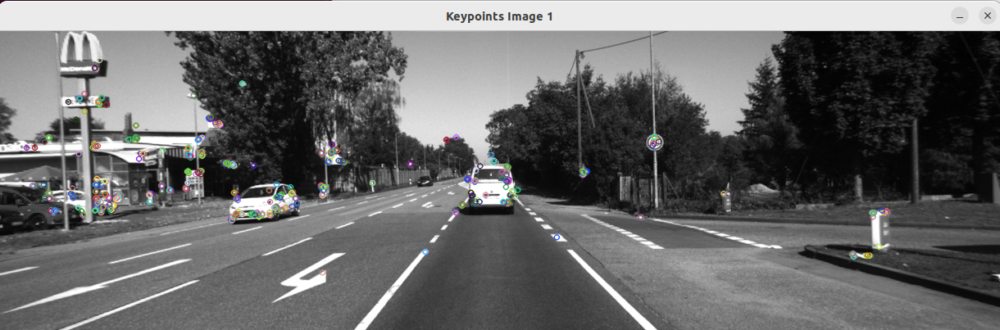
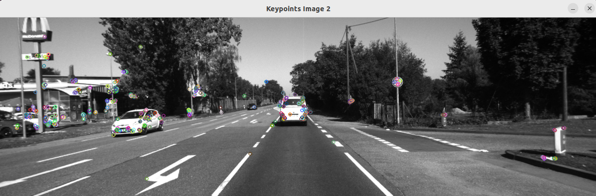
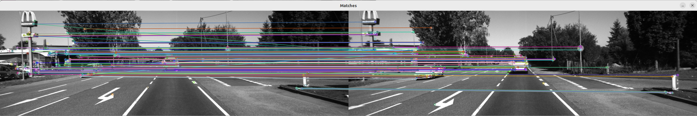
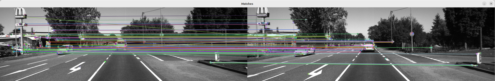
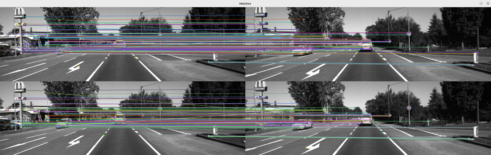
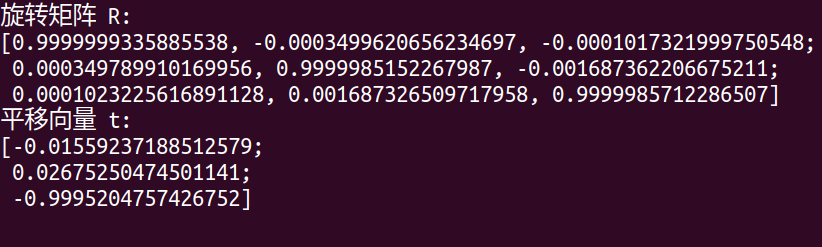
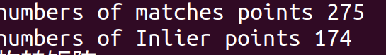
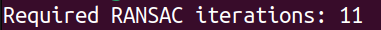

## 
 实验三：视觉特征匹配
#### 实验设置
- 采用ORB算法提取两张图像的关键点，对每个关键点计算特征向量
- 采用暴力匹配算法对两幅图像的特征向量进行匹配
- 利用RANSAC算法估计两幅图像之间的本质矩阵
- 重新检测匹配点间的位姿，剔除错误匹配点
#### 实验结果展示
   
 <b>采用ORB算法提取两张图像的关键点</b> 

   

   
<b> </b> 

   
   

   
<b> </b> 

   
   

 
   

   
<b> 利用暴力匹配算法对关键点进行匹配</b> 

   
   

 
   

   
<b> 利用RANSAC算法剔除错误匹配点</b> 

   
   

 
   

   
<b> 两次匹配图像对比</b> 

   
   

 
   

   
<b> 拍摄两张图时相机间的变换矩阵</b> 

   
   

#### 实验分析

对利用暴力算法进行特征匹配后的关键点数量和RANSAC算法剔除错误匹配点后的关键点数量进行统计，如下图所示：
   

   
<b> </b> 

   
   

可以看出，特征匹配后有148对匹配点，而剔除错误匹配点后有84对匹配点，剔除了64对错误匹配点，匹配效果更好

将两幅图像相机间的变换矩阵与标准值进行比较，标准值如下：
$$
\begin{bmatrix}
9.999996e-01& -9.035185e-04& 2.101169e-04& -1.289128e-02 \\9.037964e-04& 9.999987e-01& 1.325646e-03& 1.821616e-02 \\2.089193e-04& -1.325834e-03& 9.999991e-01& -1.310643e+00 \\
0 & 0 & 0 & 1
\end{bmatrix}
$$
可以看出，求出的变换矩阵与标准值基本一致，但平移向量存在一些误差，可能是由于提取特征点时由于噪声、光照、视角的变化导致检测的特征点不准确或相机的内参标定存在误差导致的

#### 思考题
**改进一：**
在原来利用RANSAC算法估计本质矩阵时，由于本质矩阵 $E = t \times R$, $t$ 和 $R$分别具有三个自由度，而组合在一起时，可以进行尺度的缩放，因此本质矩阵E有5个自由度，需要8对匹配点来进行估计。
而对于平面运动来说，$t$有三个自由度，而由于在平面中只能绕一个轴旋转，因此$R$只有一个自由度，因此本质矩阵E有3个自由度，只需要5对匹配点来进行估计。而匹配点减少后，求解本质矩阵的精度和效率会提高，从而错误点剔除精度会更高，匹配效果更好
对于RANSAC算法来说，其迭代次数公式如下所示：
$$
N = \frac{\log(1-p)}{\log(1-(1-\epsilon)^s)}
$$
其中，$p$为置信度，$\epsilon$为错误率，$s$为最少匹配点数，$N$为迭代次数。对公式进行分析可知：由于平面运动只需要5对匹配点，而非平面运动需要8对匹配点，因此平面运动的迭代次数更少，效率更高。
在opencv中统计RANSAC算法的迭代次数进行验证：

  

    
    
<b>8对匹配点</b>

  

  

    
    
<b>5对匹配点</b>

  

可以看出，8对匹配点的迭代次数明显多于5对匹配点的迭代次数，因此平面运动采取更少的匹配点迭代次数更少，效率更高，精度也会有所提升

 
 

**改进二：**
**连续帧约束：**
由于机器人是平面运动，连续帧间的图像变化可能是连续的，可以利用前一帧的匹配结果来进行当前帧的特征匹配，从而减少匹配的搜索范围，提高匹配的效率。
**运动模型约束：**
由于机器人是平面运动，可以利用平面运动的特性，即相机的运动是平移和旋转的组合，可以利用这一特性来进行匹配点的筛选，(即避免了空间中复杂的相似变换和仿射变换)，从而提高匹配的精度和效率

