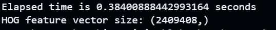

## <center> 基于传统视觉的图像分类 </center>

#### 任务一：
采用opencv的函数将图像转换为灰度图像，并绘制灰度直方图
``` bash
    # 将图像转换为灰度图
    gray_image = cv2.cvtColor(img, cv2.COLOR_BGR2GRAY)
    # 计算灰度直方图
    hist = cv2.calcHist([gray_image], [0], None, [256], [0, 256])
    plt.plot(hist, color='black')
```
**结果展示：**
   <div align = "center">
   <p align="center"><b> </b> </p >
   
   </div>
<br>

#### 任务二：
采用skimage.feature.hog函数提取图像的HOG特征，并可视化HOG特征图
``` bash

    hog_features, hog_vis = hog(gray_image, orientations=9,  pixels_per_cell(8, 8),  cells_per_block=(2, 2), visualize=True, block_norm='L2-Hys')
```

**结果展示：**
   <div align = "center">
   <p align="center"><b> </b> </p >
   
   </div>

**分析：**
- **orientations：** 该参数代表hog特征提取时每一个胞元内部的梯度方向数量（即梯度方向被分成了orientations个部分），通常取9；当该参数变大时，hog特征的维度会增大，从而hog特征储存的信息会更多，但是计算量也会增大（因为可视化差别不大，下图只展示特征数和运算时间）
 <div style="display: flex; justify-content: space-around; align-items: center;">
  <div style="text-align: center;">
    
    <p><b>orientations = 9</b></p>
  </div>
  <div style="text-align: center;">
    
    <p><b>orientations = 18</b></p>
  </div>
</div>

- **pixels_per_cell：** 该参数代表hog特征提取时每一个胞元的像素数量，通常取8；较小的单元尺寸可以提供更多的细节信息，但是会增大计算量和特征维度，同时也会增加噪声的影响，较大的单元尺寸计算速度更快，但是会丢失细节信息
<div style="display: flex; justify-content: space-around; align-items: center;">
  <div style="text-align: center;">
    
  </div>
  <div style="text-align: center;">
    
  </div>
</div>
<div style="display: flex; justify-content: space-around; align-items: center;">
  <div style="text-align: center;">
    
    <p><b>pixels_per_cell = （8，8）</b></p>
  </div>
  <div style="text-align: center;">
    
    <p><b>pixels_per_cell = （4，4）</b></p>
  </div>
</div>

-  **cells_per_block：** 该参数代表hog特征提取时每一个块内部包含的胞元数量，通常取(2, 2)；增加块的尺寸可以增加特征的平滑性，并提高特征的抗干扰能力，但也会减少特征的空间分辨率。较小的块尺寸可以捕捉更多的特征信息，更敏感于细节变化。（因为可视化差别不大，下图只展示特征数和运算时间）
 <div style="display: flex; justify-content: space-around; align-items: center;">
  <div style="text-align: center;">
    
    <p><b>cells_per_block = (2,2)</b></p>
  </div>
  <div style="text-align: center;">
    
    <p><b>cells_per_block = (8,8)</b></p>
  </div>
</div>
<br>

#### 任务三：
**hog特征提取的算法流程如下：**
1. 将图像转换为灰度图像，对图像进行Gamma校正，完成对整个图像的标准化(归一化)，可以调节图像的对比度，降低局部光照不均匀或者阴影的影响
2. 分别求取图像水平方向和垂直方向的梯度，然后计算每个像素点的梯度幅值和方向
$$
\begin{aligned}
   G_x &= I(x+1, y) - I(x-1, y) \\
G_y &= I(x, y+1) - I(x, y-1) \\
G &= \sqrt{G_x^2 + G_y^2} \\
\theta &= arctan(\frac{G_y}{G_x})  
\end{aligned}
$$
3. 将图像划分为若干个胞元(cell)，例如每个cell为8×8个像素，相邻cell之间不重叠，将所有梯度方向划分为orientations个方向块，然后在每个cell内统计梯度方向直方图
4. 将多个cell组合成更大连通块(block),在block内统计梯度直方图，并做归一化处理，能够更好地适应光照和对比度的变化
5. 将每个块的归一化方向直方图拼接在一起，形成整幅图像的特征向量

**hog特征维度计算：**
图像大小为： $432\times 768$，cell大小为$8\times 8$，block大小为$16\times 16$，每个cell梯度直方图的方向数为9，hog特征计算如下：
$$
\begin{aligned}
    \text{cell个数} &= \frac{432}{8} \times \frac{768}{8} = 6480 \\
    \text{block个数} &= （\frac{432}{8} - 16 + 1） \times （\frac{768}{8} - 16 + 1） = 3159 \\
    \text{每个block的特征维度} &= 16 \times 16 \times 9 = 2304 \\
    \text{hog特征维度} &= 3159 \times 2304 = 7278336
\end{aligned}
$$
**代码验证(使用如下代码可输出hog特征维度)：**
``` bash
print("HOG feature vector size:", hog_features.shape))
```
**结果展示：**
   <div align = "center">
   <p align="center"><b> </b> </p >
   
   </div>
<br>

#### 任务四：
在 extractFeat.py 的特征提取函数 getFeat的训练数据和测试数据中添加hog提取函数（此外，原代码中Train和Test的路径写反了，应进行修改）：
``` bash
    hog_fd = hog(gray,orientations, pixels_per_cell, cells_per_block, visualize=False,block_norm = 'L1-sqrt',transform_sqrt = True)
```
改变一些hog特征提取的参数会影响最终分类的精度，下面为几组使用的参数：
``` bash
    orientations = 9, pixels_per_cell = (8, 8), cells_per_block = (2, 2)  block_norm = 'L2-Hys',transform_sqrt = True
    orientations = 9, pixels_per_cell = (8, 8), cells_per_block = (2, 2)  block_norm = 'L1-sqrt',transform_sqrt = True
    orientations = 12, pixels_per_cell = (8, 8), cells_per_block = (2, 2)  block_norm = 'L1-sqrt',transform_sqrt = True    
```
经classifier.py的分类器训练和测试，得到如下结果：
``` bash
    orientations = 9, pixels_per_cell = (8, 8), cells_per_block = (2, 2)  block_norm = 'L2',transform_sqrt = True
    Accuracy: 0.527400
    orientations = 9, pixels_per_cell = (8, 8), cells_per_block = (2, 2)  block_norm = 'L1-sqrt',transform_sqrt = True
    Accuracy: 0.537600
    orientations = 12, pixels_per_cell = (8, 8), cells_per_block = (2, 2)  block_norm = 'L1-sqrt',transform_sqrt = True
    Accuracy: 0.543600
```
分类的精度均大于50%，符合要求
除了hog特征提取的参数，还可以改变分类器的超参数来改变分类的精度，例如改变SVM的C值，当C变大时，分类器会更关注训练集的分类准确性，但是容易过拟合，当C变小时，分类器会更关注分类的泛化能力，但精度有所下降，下面为几组使用的参数（hog特征提取采用最后一组参数）：
``` bash
    C = 0.01
    Accuracy: 0.511500
    C = 0.1
    Accuracy: 0.530900
    C = 1.0
    Accuracy: 0.543600
    C = 100.0
    Accuracy: 0.544400
```

<br>

#### 任务五：
对于交通标志数据集需要重写extractFeat.py的getFeat和load_images函数，因为交通标志数据集的数据是以图片形式保存的，不同于cifar-10数据集的二进制保存，所以需要使用cv2.imread()读取图片，然后使用hog提取特征，最后将特征和标签保存到文件中，load_images函数修改如下：
``` bash
img = cv2.imread(img_path)
if img is not None:
    images.append(img)
    labels.append(class_folder)  
```
getFeat函数修改如下：
``` bash
    label_mapping = {label: idx for idx, label in enumerate(set(labels))}  # 创建标签映射
    for i, img in enumerate(images):
        gray_img = color.rgb2gray(img)  # 将图像转换为灰度图
        # 提取 HOG 特征
        hog_fd = hog(gray_img, orientations=orientations, pixels_per_cell=pixels_per_cell,
                     cells_per_block=cells_per_block, block_norm='L1-sqrt', transform_sqrt=True)
        
        # 添加标签
        label = label_mapping[labels[i]]  # 获取整数标签
        feature_data = np.concatenate([hog_fd, [label]])  # 将特征和标签
```
然后利用classifier.py的分类器训练和测试，得到如下结果：
   <div align = "center">
   <p align="center"><b> orientations = 12, pixels_per_cell = (8, 8), cells_per_block = (2, 2)  block_norm = 'L1-sqrt',transform_sqrt = True </b> </p >
   
   </div>

   <div align = "center">
   <p align="center"><b> orientations = 9, pixels_per_cell = (8, 8), cells_per_block = (2, 2)  block_norm = 'L1-sqrt',transform_sqrt = True </b> </p >
   
   </div>


