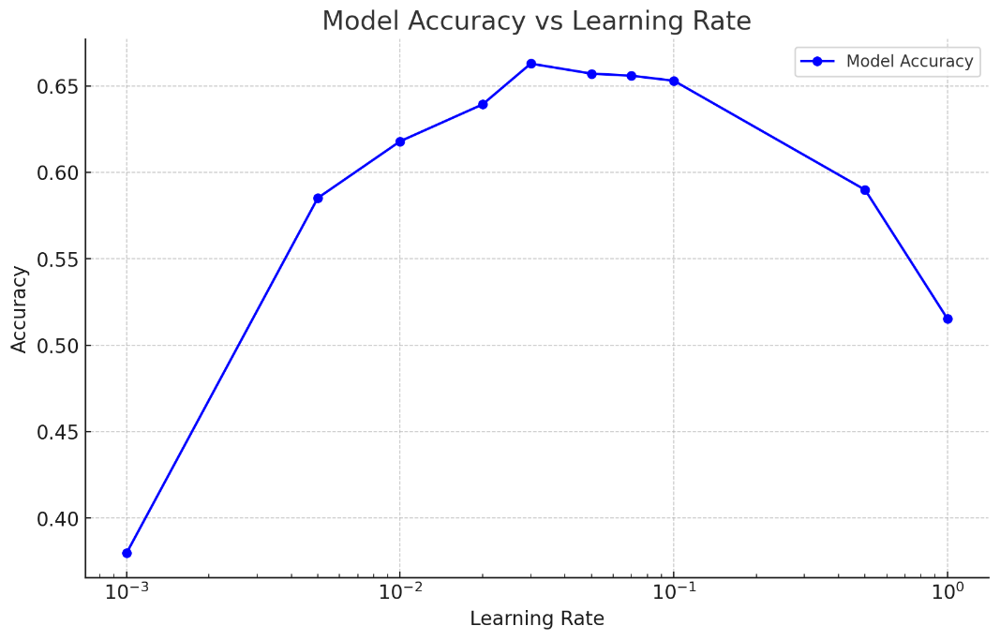
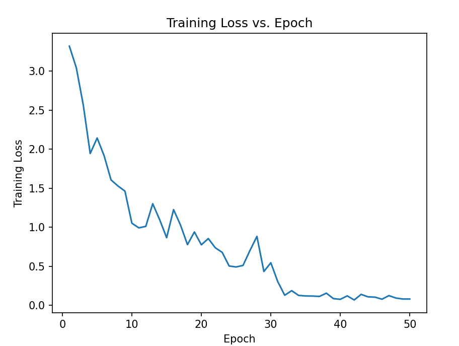
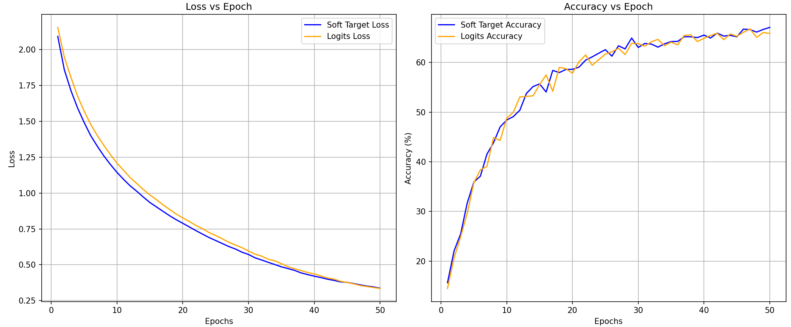

## <center> 基于卷积网络的图像分类 </center>
#### 任务一
**任务描述：** 安装pytorch，跑通得到resnet10分类cifar100数据集的精度
<br>
**完成过程：** 使用Anaconda创建python环境3.9.20并安装pytorchtorch == 1.10.0 torchvision == 0.11.0 pytorch-ignite == 0.1.1以及其他依赖包，然后使用如下命令在GPU上运行示例程序 resnet-cifar100.py(注：修改config.yml里的学习率为0.03)
``` bash
python resnet-cifar100.py --config config.yml --device 0
```
得到的结果为：
``` bash
Model Accuracy: 0.6629
Total time: 1829.38906788826
```
<br>

#### 任务二
**任务描述：** 修改网络的优化器，至少尝试Adam和另外一种，对不同的优化器进行实验分析
<br>

**完成过程：**
原代码采用的网络优化器为**SGD优化器**，即基于当前模型参数使用小批量数据计算损失函数相对于这些参数的梯度，然后根据学习率和梯度调整参数（同时引入动量项，防止陷入局部最优）
```python
optimizer = torch.optim.SGD(model.parameters(), lr=lr, momentum=0.9, weight_decay=0.0001)
```
修改网络优化器为**Adam优化器**，Adam 的核心思想是对每个参数的学习率进行自适应调整，从而在训练中可以自动平衡各参数的更新幅度。在每次迭代时，Adam优化器会更新两个动量项，一阶动量项为参数梯度的均值，可以帮助算法找到正确的方向并避免震荡；二阶动量项为参数梯度的方差，有助于降低学习率，对偏差较大的梯度进行抑制。
```python
optimizer = torch.optim.Adam(model.parameters(), lr=lr, weight_decay=0.0001)
```
修改网络优化器为**Adagrad优化器**，Adagrad会根据每个参数的更新历史来动态调整学习率，使得较频繁更新的参数学习率逐渐减小，较少更新的参数学习率保持相对较高
```python
optimizer = torch.optim.Adagrad(model.parameters(), lr=lr, weight_decay=0.0001)
```
采用三种优化器训练的结果如下：
**SGD优化器**
```bash
(lr = 0.001)
Model Accuracy: 0.3798
Total time: 1862.2474205493927

(lr = 0.03)
Model Accuracy: 0.6629
Total time: 1829.38906788826
```
**Adam优化器**
```bash
(lr = 0.001)
Model Accuracy: 0.649
Total time: 1994.84578490357
```
**Adagrad优化器**
```bash
(lr = 0.001)
Model Accuracy: 0.6237
Total time: 1862.2086212635004
```
从三种优化器的结果可以看出，SGD优化器对学习率的要求较高，当学习率为0.001时，模型的精度较差，仅有37.98%，当学习率为0.03时，模型能达到较高的精度66.29%（但达到较高的精度需要手动调参，过程较为复杂），而Adam优化器和Adagrad优化器由于可以自适应调整学习率，仅采用初始学习率0.001便可以达到较高的精度，无需手动调整学习率。三种优化器训练的时间相近，Adam优化器由于每次需要更新两个动量项，所需时间略长。
<br>

#### 任务三
**任务描述：**
- 使用SGD优化器，改变config中learning_rate学习率，分析它的影响
- 实现学习率动态调节，以0.1为初始学习率，在30和40epoch分别降低10倍，分析收敛曲线
<br>

**完成过程：**
- 分别采用0.001，0.005，0.01，0.02，0.03，0.05，0.07，0.1，0.5，1的学习率进行模型训练，得到模型准确率并绘制准确率-学习率图像
- pytorch自带了学习率动态调整的模块MultiStepLR
    ```python
    from torch.optim.lr_scheduler import MultiStepLR
    ```
  然后创建学习率更新器，在30和40epoch分别降低10倍，并绘制tranloss-epoch的图像
  ```python
   scheduler = MultiStepLR(optimizer, milestones=[30, 40], gamma=0.1)
   @trainer.on(Events.EPOCH_COMPLETED)
   def log_training_loss(engine):
        epoch_loss = engine.state.output
        train_losses.append(epoch_loss)
        scheduler.step()
    ```

**得到的结果如下：**
```bash
(lr = 0.001)
Model Accuracy: 0.3798
Total time: 1862.2474205493927

(lr = 0.005)
Model Accuracy: 0.5852
Total time: 1882.7012154533386

(lr = 0.01)
Model Accuracy: 0.618
Total time: 1856.60478214567

(lr = 0.02)
Model Accuracy: 0.6393
Total time: 1798.2210807800293

(lr = 0.03)
Model Accuracy: 0.6629
Total time: 1829.38906788826

(lr = 0.05)
Model Accuracy: 0.6571
Total time: 1822.8216421604156

(lr = 0.07)
Model Accuracy: 0.6559
Total time: 1824.6506157994873

(lr = 0.1)
Model Accuracy: 0.653
Total time: 1889.906635060052

(lr = 0.5)
Model Accuracy: 0.5899
Total time: 1879.6979380216827

(lr = 1)
Model Accuracy: 0.5153
Total time: 1737.711599745343
```
**绘制学习率-准确率图像如下：**
   <div align = "center">
   <p align="center"><b></b> </p >
   
   </div>
可以看出，学习率过大和过小时模型的精度均不高，这是因为学习率过大时模型参数更新幅度太大，导致优化过程在局部最小值或最佳解附近来回震荡，甚至不收敛以及损失值会在训练过程中频繁波动，使模型难以找到稳定的最优解；学习率过小时更新步伐太小，使得模型需要更多的迭代次数才能达到理想状态以及优化器可能陷入局部最小值而非全局最小值，导致性能低于预期。因此，采用SGD优化器时需手动调整，采用适中的学习率，才能使模型达到更高的精度

**采用动态学习率调整绘制trainloss-epoch图像如下：**
   <div align = "center">
   <p align="center"><b></b> </p >
   
   </div>
   采用动态学习率有助于提升模型的收敛性和减少损失震荡：在训练初期，较大的学习率帮助模型快速接近最优解；当模型在初期收敛后，逐步降低学习率可以让模型更稳定地逼近最优解。同时，在中后期降低学习率能够减小每次参数更新的步幅，从而减少损失值的震荡现象，使损失曲线趋于平稳

   从图像中可以清晰地看出，在30epoch后损失曲线的震荡减少，趋于平稳，同时模型的精度达到71.48%，较未动态调整学习率的模型精度65.3%有提升。
<br>

#### 任务四
**任务描述：** 将网络修改成resnet18和resnet50，进行分类，同时分析三种不同的网络的效果和训练时间
<br>

**实现过程：**
resnet18和resnet10具有相同的残差块BasicBlock（含有两个卷积层），且都包含4个残差模块，不同的是resnet10网络每个残差模块只有一个残差块，resnet18每个残差模块有两个残差快；而resnet50的残差块为Bottleneck（含有三个卷积层），且四个残差模块包含的残差块为3，4，6，3
**resnet18**
```python
def resnet18(**kwargs):
    return ResNetCustom(BasicBlock, [2, 2, 2, 2], **kwargs)
```
**resnet50**
```python
from torchvision.models.resnet import Bottleneck, ResNet
def resnet50(**kwargs):
    return ResNetCustom(Bottleneck, [3, 4, 6, 3], **kwargs)
```

采用相同的学习率（lr = 0.03）得到的三种模型的结果如下：

<table style="width: 100%; border-collapse: collapse;">
    <tr>
        <th style="width: 25%; text-align: center;">模型名称</th>
        <th style="width: 25%; text-align: center;">Resnet10</th>
        <th style="width: 25%; text-align: center;">Resnet18</th>
        <th style="width: 25%; text-align: center;">Resnet50</th>
    </tr>
    <tr>
        <td style="text-align: center;">模型精度</td>
        <td style="text-align: center;">66.29%</td>
        <td style="text-align: center;">68.28%</td>
        <td style="text-align: center;">72.45%</td>
    </tr>
    <tr>
        <td style="text-align: center;">训练时间</td>
        <td style="text-align: center;">1829.38906788826s</td>
        <td style="text-align: center;">2781.9894111156464s</td>
        <td style="text-align: center;">58943.235444321231s</td>
    </tr>
</table>

从结果可以看出，resnet50的精度最高，达到72.45%，resnet18次之，达到68.28%，resnet10最低，达到66.29%。但是resnet50的训练时间远远高于resnet18和resnet10(精度提升只有几个百分点)。因此，选择模型时需要根据实际情况进行选择，如果对训练时间要求不高，可以选择resnet50，如果对训练时间要求较高，可以选择resnet18或resnet10

<br>

#### 任务五
**任务描述：** 使用知识蒸馏方法，用resnet50对resnet18进行蒸馏，使用loss: soft target和loss：logits，对比效果
<br>
**实现过程：**
知识蒸馏的主要思想是将学习能力强的复杂教师模型中的“知识”迁移到简单的学生模型中，我选取了pytorch中预训练好的resnet50模型作为教师模型，选择自己创建的resnet18网络作为学生模型
```python
teacher_model = torchvision.models.resnet50(pretrained=True).to(device)
teacher_model.fc = nn.Linear(teacher_model.fc.in_features, 100).to(device)
teacher_model.eval()
student_model = resnet18(num_classes=100).to(device)
```
然后创建两个损失函数并进行训练与对比，一个为logits_loss，即学生模型的logits直接与教师模型的logits进行匹配，目标是让学生模型的原始输出尽可能接近教师模型的输出，另一个为Soft Target Loss，该损失是用softmax函数处理教师模型的输出，得到教师模型的概率分布，学生模型输出的logits同样经过softmax和对数softmax处理，并引入温度对输出进行平滑性处理，然后计算这两个概率分布之间的Kullback-Leibler散度，得到软目标损失，这样做的好处是不仅让学生模型学习到正确的类别，还能捕捉到不同类别之间的相对关系
```python
def soft_target_loss(student_logits, teacher_logits, temperature=3.0):
    teacher_probs = torch.nn.functional.softmax(teacher_logits / temperature, dim=1)
    student_probs = torch.nn.functional.log_softmax(student_logits / temperature, dim=1)
    return torch.nn.functional.kl_div(student_probs, teacher_probs, reduction='batchmean') * (temperature ** 2)

def logits_loss(student_logits, teacher_logits):
    return torch.nn.functional.mse_loss(student_logits, teacher_logits)
```
然后由于仅用上述损失函数无法得到模型预测值与精确值间的关系，精度不高，因此我们将上述损失函数和监督损失函数做加权，得到最终的损失函数
```python
# 计算监督损失
L_supervised = criterion_supervised(student_logits, labels)
# 计算 soft target 和 logits 损失
if loss_type == "soft_target":
    L_distill = soft_target_loss(student_logits, teacher_logits)
    L_logits = torch.tensor(0).to(device)  # 不使用logits损失
elif loss_type == "logits":
    L_distill = torch.tensor(0).to(device)  # 不使用soft target损失
    L_logits = logits_loss(student_logits, teacher_logits)
else:
    raise ValueError("Unsupported loss type")
# 综合损失函数
L_total = alpha * L_supervised + beta * L_distill + beta * L_logits
```

将采用两种损失函数得到的准确率和损失关于epoch绘制图表，结果如下：
   <div align = "center">
   <p align="center"><b></b> </p >
   
   </div>
可以看出，采用两种损失函数训练的模型精度和损失相近，采用soft-target损失函数训练得到的模型精度略高于采用Logits作为损失函数的精度，soft-target损失略少于
logits函数


<br>

#### 任务六
**任务描述：** 采用resnet网络对交通标志数据集进行分类，并调参优化精度
<br>
**实现过程：** 采用ImageFolder函数读取交通标志数据集中的训练和测试数据，并以此构建训练集和测试集
```bash
train_set = ImageFolder(root='./Traffic_sign/train_dataset', transform=transform)
test_set = ImageFolder(root='./Traffic_sign/test_dataset', transform=transform)

# Create data loaders
train_loader = torch.utils.data.DataLoader(train_set, batch_size=bsize,
                                        shuffle=True, num_workers=workers)

test_loader = torch.utils.data.DataLoader(test_set, batch_size=bsize,
                                        shuffle=False, num_workers=workers)
```
然后修改transform函数，去除对图像做水平翻转和随机裁剪的处理，使模型捕获更多图像信息，提升训练的精度。
```python
transform = transforms.Compose([
    transforms.Resize((32, 32)),  # Resize 到合适的大小
    transforms.ToTensor(),
    transforms.Normalize((0.5, 0.5, 0.5), (0.5, 0.5, 0.5))
])
```
然后采用如下参数进行训练，得到模型的精度和训练时间
```bash
workers: 4
bsize: 256
epochs: 50
lr: 0.03
```


```bash
Model Accuracy: 0.9660493827160493
Total time: 847.6943428516388
```


